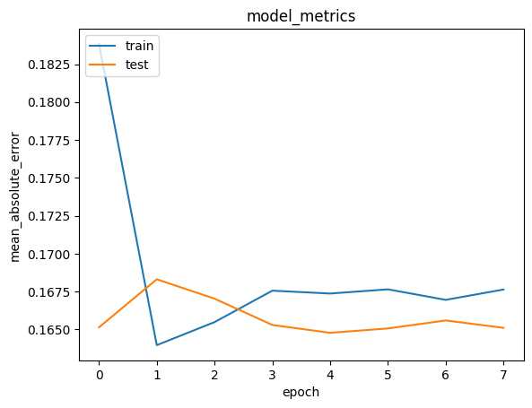

# Laporan Proyek Machine Learning - Wildan Aziz Hidayat

  
Figure 1.0: A collection of popular movies

## Project Overview

Sistem rekomendasi film adalah salah satu aplikasi machine learning yang populer dan memiliki dampak signifikan pada industri hiburan. Proyek ini bertujuan untuk mengembangkan sebuah sistem rekomendasi berbasis content-based filtering dan collaborative filtering.

Sistem ini akan membantu pengguna menemukan film yang sesuai dengan preferensi mereka, berdasarkan data rating pengguna dan informasi genre film. Pendekatan ini tidak hanya memberikan pengalaman personalisasi yang lebih baik bagi pengguna, tetapi juga meningkatkan engagement platform streaming.

Metode ini bertujuan untuk memperbaiki masalah saran-saran tertentu, yang terjadi ketika data yang relevan bagi pengguna diabaikan. Metode ini mengekstrak tipe kepribadian pengguna, pengalaman menonton sebelumnya, dan data dari banyak basis data lain yang berkaitan dengan kritikus film. Hal ini difokuskan pada estimasi kesamaan komposit. Metodologi ini adalah sistem hibrida yang menggabungkan teknik penyaringan berbasis konten dan kolaboratif. Hongli LIn dkk. menyarankan sebuah proses yang disebut penyaringan kolaboratif yang didukung konten untuk memprediksi kompleksitas model dari contoh tertentu untuk setiap kandidat (CBCF). Metode ini dibagi menjadi dua tahap: "penyaringan berbasis konten", yang meningkatkan informasi tentang tinjauan skenario peserta pelatihan saat ini, dan "penyaringan kolaboratif", yang memberikan prediksi yang paling akurat. Algoritme CBCF mempertimbangkan pendekatan berbasis konten dan kolaboratif, mengatasi kedua kekurangannya secara bersamaan.[[1]](https://ieeexplore.ieee.org/document/9872515/authors#authors)

**Referensi**: [[1] J. F. Mohammad and S. Urolagin, "Movie Recommender System Using Content-based and Collaborative Filtering," 2022 IEEE IAS Global Conference on Emerging Technologies (GlobConET), 20-22 May 2022, doi: 10.1109/GlobConET53749.2022.9872515.](https://ieeexplore.ieee.org/document/9872515/authors#authors)

## Business Understanding

### Problem Statements
1. Bagaimana memberikan rekomendasi film kepada pengguna berdasarkan genre yang disukai?
2. Bagaimana memanfaatkan data rating pengguna untuk memberikan rekomendasi yang lebih relevan?

### Goals
1. Mendapatkan rekomendasi film berdasarkan genre atau tema dari movies yang disukai dengan tingkat Recall@K lebih dari 80%.
2. Mendapatkan rekomendasi film berdasarkan movies yang pernah dirating sebelumnya dengan error lebih kecil dari 50%.

### Solution Statements
- Mengembangkan sistem rekomendasi berbasis content-based filtering yang memanfaatkan informasi genre film dengan menggunakan algoritma TF-IDF dan cosine similarity untuk membuat sistem rekomendasi film berdasarkan genre yang mirip dengan film yang disukai.
- Mengembangkan sistem rekomendasi berbasis collaborative filtering menggunakan data rating pengguna untuk meningkatkan relevansi rekomendasi dengan menggunakan pendekatan embedding dengan TensorFlow/Keras untuk membangun model collaborative filtering dengan outcome sistem rekomendasi yang mirip dengan film yang pernah dirating sebelumnya.


## Data Understanding

Dataset yang digunakan diperoleh dari [Kaggle](https://www.kaggle.com/datasets/ayushimishra2809/movielens-dataset), yang terdiri dari dua file utama:
1. **movies.csv**: Berisi informasi mengenai judul film dan genre.
2. **ratings.csv**: Berisi data rating yang diberikan pengguna terhadap film.

Jumlah data:
- **movies.csv**: 10329 baris dan 3 kolom.
- **ratings.csv**: 105339 baris dan 4 kolom.

### Variabel-variabel pada dataset:
#### movies.csv
- **movieId**: ID unik untuk setiap film.
- **title**: Judul film.
- **genres**: Genre film dalam format string.

#### ratings.csv
- **userId**: ID unik untuk setiap pengguna.
- **movieId**: ID unik untuk setiap film.
- **rating**: Rating yang diberikan oleh pengguna.
- **timestamp**: Waktu ketika rating diberikan.

#### Info Data movies.csv
Dataset ini mengandung 10329 entri dan 3 kolom
|   # | Column   | Non-Null Count | Dtype   |
| --: | -------- | -------------- | ------- |
|   0 | movieId  | 10329 non-null | int64   |
|   1 | title    | 10329 non-null | object  |
|   2 | genres   | 10329 non-null | object  |


#### Info Data ratings.csv

Dataset ini mengandung 105339 entri dan 4 kolom

|   # | Column      | Dtype |
| --: | ----------- | ----- |
|   0 | userId      | int64 |
|   1 | movieId     | int64 |
|   2 | rating      | int64 |
|   3 | timestamp   | int64 |

#### Visualisasi Data Ratings
  
Gambar 2.0 plot kolom rating dari dataframe "rating"

Di label "count" maksimum nilainya berada kurang dari 30000.

Di label "rating" terdapat bar setelah angka 0 yang artinya banyak user yang memberi rating 0.5 menandakan rating terendah yakni 0.5.

Selanjutnya, Pada grafik distribusi rating tersebut dapat dilihat bahwa mayoritas pengguna cenderung memberikan rating tinggi, dengan puncak distribusi berada pada rating 4 dan 5. Hal ini menunjukkan adanya bias positif dalam penilaian, di mana sebagian besar film dianggap cukup baik oleh pengguna. Sebaliknya, rating rendah (di bawah 3) relatif jarang diberikan, sehingga distribusi rating terlihat tidak merata. Kondisi ini mengindikasikan bahwa rata-rata rating dalam dataset kemungkinan mendekati nilai tinggi, yang dapat memengaruhi hasil sistem rekomendasi jika tidak ditangani dengan baik.

Untuk mengatasi bias ini dan menghasilkan sistem rekomendasi yang optimal, saya mengombinasikan content-based filtering dan collaborative filtering. Kombinasi kedua pendekatan ini memungkinkan sistem untuk menangani bias distribusi rating, memberikan rekomendasi yang lebih relevan, dan mencakup preferensi individual maupun pola kolektif pengguna.

  
Gambar 2.1 plot kolom movieId dan userId dari dataframe "rating"

Terlhat jumlah user unik yang memberi rating berada di angka 6.1% dan jumlah film unik yang diberi rating lebih dari 93.9%. Data ini bersifat **many-to-many** yang berarti bahwa 1 user bisa memberi rating ke banyak movies dan 1 movies bisa diberi rating oleh banyak user

#### Penanganan Missing Value

`movies`
|   # | Column      |       |
| --: | ----------- | ----- |
|   0 | movieId     | 0     |
|   1 | title       | 0     |
|   2 | genres      | 0     |
dtype: int64

`ratings`
|   # | Column      |       |
| --: | ----------- | ----- |
|   0 | userId      | 0     |
|   1 | movieId     | 0     |
|   2 | rating      | 0     |
|   2 | timestamp   | 0     |
dtype: int64

Pada penanganan missing value untuk movies dan ratings ini dapat dilihat bahwa tidak ada data yang bernilai null maka dari itu tidak ada data yang dihapus

#### Penanganan Data Duplikat

`movies`
```Empty DataFrame
Columns: [movieId, title, genres]
Index: []```

`ratings`
```Empty DataFrame
Columns: [userId, movieId, rating, timestamp]
Index: []```
```

Pada penanganan data duplikat untuk movies dan ratings ini dapat dilihat bahwa tidak ada data yang terduplikasi maka dari itu tidak ada data yang dihapus

#### Penanganan Outliers
`kolom rating pada ratings.csv`
```
Jumlah outliers: 4456
```

Pada data tersebut dapat dilihat bahwa jumlah outliers pada kolom rating adalah **4456**. Pada beberapa kasus outliers yang berada diangka **4%** tidak dianggap besar dan cenderung kecil. maka pada penanganan outliers tidak akan dihapus karena membiarkan outliers bisa lebih optimal jika mereka mewakili pola perilaku pengguna yang sah dan bisa memperkaya hasil rekomendasi.


## Data Preparation

### Teknik yang diterapkan:
1. **Genre ke format list**: Mengubah string genre menjadi format list untuk analisis lebih lanjut.
2. **Encoding userId dan movieId**: Mengubah ID menjadi representasi numerik agar dapat digunakan dalam modeling collaborative filtering.
3. **Splitting data**: Membagi data menjadi training (80%) dan validation (20%).
4. **Ekstraksi Fitur TF-IDF**: Ekstraksi Fitur TF-IDF pada data movies guna mendapatkan informasi mengenai genre yang terdapat di setiap movies dan diubah menjadi fitur yang dapat diukur kemiripannya.

### Genre ke Format List
- Pada tahap ini genre dari setiap movies di dataframe **movies.csv** akan diubah menjadi bentuk array(list). Hal ini dilakukan untuk mempermudah akses ke genre di kolom "genres". Hasilnya sebagai berikut

|   # | movieId  |                          title   |                                             genres |
| --: | -------: | ---------------------------------: | ------------------------------------------------: |
|   0 |    1     |                 Toy Story (1995)   | [Adventure, Animation, Children, Comedy, Fantasy] |
|   1 |    2     |                   Jumanji (1995)   |                    [Adventure, Children, Fantasy] |
|   2 |    3     |          Grumpier Old Men (1995)   |                                 [Comedy, Romance] |
|   3 |    4     |         Waiting to Exhale (1995)   |                          [Comedy, Drama, Romance] |
|   4 |    5     | Father of the Bride Part II (1995) |                                          [Comedy] |

Proses ini diperlukan untuk memastikan data siap digunakan oleh algoritma machine learning dan meningkatkan performa model.

### Encoding userId dan movieId
- Pada tahap ini dilakukan proses encoding pada kolom userId dan movieId kemudian dimasukkan ke kolom baru masing-masing. Hal ini dilakukan untuk merepresentasikan id user dan movie dalam format yang dapat di proses oleh model machine learning.

### Splitting data

- Melakukan pemisahan pada dataframe menjadi train dan validasi dengan rasio 80:20, namun data di acak terlebih dahulu sebelum di pisah. Hal ini dilakukan supaya model dapat melakukan evaluasi pada data baru serta mencegah overfitting

`Mengacak Data`
|        | userId | movieId | rating | user_id | movie_id |
|--------|--------|---------|--------|---------|----------|
| 41032  | 285    | 2605    | 3.0    | 284     | 1575     |
| 1938   | 24     | 897     | 4.0    | 23      | 1118     |
| 92480  | 607    | 4016    | 4.0    | 606     | 318      |
| 30160  | 219    | 3981    | 2.0    | 218     | 2522     |
| 28079  | 203    | 546     | 2.0    | 202     | 407      |
| ...    | ...    | ...     | ...    | ...     | ...      |
| 54886  | 402    | 780     | 2.5    | 401     | 34       |
| 76820  | 541    | 2334    | 4.0    | 540     | 2489     |
| 103694 | 668    | 55288   | 2.5    | 667     | 2733     |
| 860    | 11     | 377     | 3.0    | 10      | 19       |
| 15795  | 128    | 3753    | 3.0    | 127     | 1983     |

`Splitting Data`

```
X_train shape:  (84271, 2)
X_val shape:  (21068, 2)
y_train shape:  (84271,)
y_val shape:  (21068,)
Training data:          user_id  movie_id
41032       284      1575
1938         23      1118
92480       606       318
30160       218      2522
28079       202       407
...         ...       ...
54886       401        34
76820       540      2489
103694      667      2733
860          10        19
15795       127      1983

[105339 rows x 2 columns]
Target data:  [0.55555556 0.77777778 0.77777778 ... 0.44444444 0.55555556 0.55555556]
```

### Fitur Ekstraksi TF-IDF
- Pada tahap ini fitur ekstraksi TF-IDF, sebelum proses modelling terutama content based filtering digunakan sebagai jembatan antara data teks mentah dan model rekomendasi dengan cara memberikan representasi yang bermakna dan relevan, sekaligus mengurangi noise dari data teks. Sejalan dengan hal itu guna mendapatkan informasi mengenai genre yang terdapat di setiap movies dan diubah menjadi fitur yang dapat diukur kemiripannya. Contohnya adalah sebagai berikut

| Title                                                       | horror | war | comedy | western | romance | drama | musical | sci  | thriller |
|-------------------------------------------------------------|--------|-----|--------|---------|---------|-------|---------|------|----------|
| Cloudy with a Chance of Meatballs (2009)                    | 0.0    | 0.0 | 0.0    | 0.0     | 0.000000 | 0.0   | 0.000000 | 0.0  | 0.00000  |
| Red (2008)                                                 | 0.0    | 0.0 | 0.0    | 0.0     | 0.000000 | 0.0   | 0.550387 | 0.0  | 0.83491  |
| Davy Crockett, King of the Wild Frontier (1955)             | 0.0    | 0.0 | 0.0    | 0.0     | 0.832344 | 0.0   | 0.000000 | 0.0  | 0.00000  |
| Ghost of Frankenstein, The (1942)                           | 0.0    | 1.0 | 0.0    | 0.0     | 0.000000 | 0.0   | 0.000000 | 0.0  | 0.00000  |
| Most Hated Family in America, The (2007)                    | 0.0    | 0.0 | 0.0    | 0.0     | 0.000000 | 0.0   | 0.000000 | 0.0  | 0.00000  |


## Modeling

### Content-Based Filtering
- **Pendekatan**: Menggunakan TF-IDF yang sebelumnya telah di fitur ekstraksi dari genre film kemudian diikuti dengan perhitungan cosine similarity.
- **Output**: Top-N rekomendasi film berdasarkan kesamaan genre dengan input film yang diberikan.

Teknik **Content-Based Filtering** merupakan teknik sistem rekomendasi untuk merekomendasikan suatu produk yang memiliki kemiripan dengan produk yang disukai. Dalam kasus ini sistem akan merekomendasikan movies berdasarkan kemiripan genre dengan movies yang disukai pengguna. Teknik ini menggunakan rumus **Cosine Similarity** untuk mendapatkan kecocokan antara produk 1 dengan yang lain.

Formula untuk **Cosine Similarity** adalah:  
$\displaystyle cos~(\theta) = \frac{A \cdot B}{\|A\| \|B\|}$

Setelah sebelumnya pada data preparation sudah melakukan fitur ekstraksi TF-IDF. Langkah selanjutnya **Cosine Similarity** akan diterapkan pada dataframe movies yang telah dibersihkan sehingga menghasilkan output sebagai berikut:

| Title                                                      | Guilty as Sin (1993) | Girl Who Kicked the Hornet's Nest, The (Luftslottet som sprängdes) (2009) | Leopard Man, The (1943) | American Haunting, An (2005) | Chain Reaction (1996) | Fellini Satyricon (1969) | Hereafter (2010) | Tetsuo, the Ironman (Tetsuo) (1988) | Attack the Block (2011) | Stone (2010) |
|------------------------------------------------------------|----------------------|----------------------------------------------------------------------------|------------------------|-----------------------------|-----------------------|--------------------------|------------------|-------------------------------------|-------------------------|--------------|
| Kingdom, The (2007)                                        | 0.530410             | 0.339414                                                                   | 0.385744               | 0.385744                    | 0.698413              | 0.167196                 | 0.167196         | 0.489422                            | 0.310663                | 0.739518    |
| Blackadder's Christmas Carol (1988)                         | 0.000000             | 0.000000                                                                   | 0.000000               | 0.000000                    | 0.000000              | 0.000000                 | 0.000000         | 0.000000                            | 0.344642                | 0.000000    |
| Pineapple Express (2008)                                    | 0.452900             | 0.656832                                                                   | 0.000000               | 0.000000                    | 0.343118              | 0.000000                 | 0.000000         | 0.240444                            | 0.437749                | 0.000000    |
| I Confess (1953)                                            | 0.598829             | 0.000000                                                                   | 0.435502               | 0.435502                    | 0.516846              | 0.000000                 | 0.000000         | 0.362186                            | 0.000000                | 0.834910    |
| Ink (2009)                                                  | 0.000000             | 0.206915                                                                   | 0.000000               | 0.000000                    | 0.231229              | 0.502118                 | 0.502118         | 0.670387                            | 0.783547                | 0.000000    |

Di tabel tersebut dapat dilihat kecocokan dari 1 movies dengan yang lain. Nilai-nilai pada tabel tersebut merepresentasikan persentase kecocokan antara kedua movies tersebut.

#### Mendapatkan top-N rekomendasi
Tabel tersebut adalah dataframe cosine similarity yang akan digunakan untuk mendapatkan top-N rekomendasi movies. Dalam kasus ini akan dicoba mendapatkan top-10 rekomendasi movies yang mirip dengan movies **"Sherlock Holmes (2010)"**. Outputnya sebagai berikut

Data untuk uji coba
| # | title                          | genres                           |
|--:|:------------------------------:|:--------------------------------:|
| 0 | Sherlock Holmes (2010)         | [Mystery, Sci-Fi]                |

Hasil rekomendasi

| Title                                                     | Genres                      |
|-----------------------------------------------------------|-----------------------------|
| Andromeda Strain, The (1971)                              | [Mystery, Sci-Fi]            |
| Stalker (1979)                                            | [Drama, Mystery, Sci-Fi]     |
| Solaris (Solyaris) (1972)                                  | [Drama, Mystery, Sci-Fi]     |
| Sound of My Voice (2011)                                  | [Drama, Mystery, Sci-Fi]     |
| Fire in the Sky (1993)                                    | [Drama, Mystery, Sci-Fi]     |
| Big Empty, The (2003)                                     | [Comedy, Mystery, Sci-Fi]    |
| Stepford Wives, The (1975)                                | [Mystery, Sci-Fi, Thriller]  |
| District 9 (2009)                                         | [Mystery, Sci-Fi, Thriller]  |
| Seconds (1966)                                            | [Mystery, Sci-Fi, Thriller]  |
| Twelve Monkeys (a.k.a. 12 Monkeys) (1995)                 | [Mystery, Sci-Fi, Thriller]  |

Berdasarkan hasil rekomendasi tersebut dapat dilihat bahwa movies yang direkomendasikan memiliki genre yang mirip dengan input movienya yaitu genre "Mystery" dan "Sci-Fi".


#### Kelebihan Content-Based Filtering:
- Tidak memerlukan data pengguna.
- Cocok untuk sistem dengan data pengguna yang terbatas.

#### Kekurangan Content-Based Filtering:
- Tidak memperhitungkan variasi preferensi antar pengguna.

### Collaborative Filtering
- **Pendekatan**: Membuat embedding untuk pengguna dan film menggunakan TensorFlow/Keras. Model dioptimalkan menggunakan fungsi loss binary crossentropy.
- **Output**: Top-N rekomendasi film untuk pengguna tertentu berdasarkan pola rating.

Teknik **Collaborative Filtering** merupakan teknik sistem rekomendasi untuk merekomendasikan suatu produk berdasarkan kesamaan preferensi antar user. Dalam kasus ini sistem akan menggunakan movie yang dirating tinggi oleh user untuk mencari kesamaan dengan user lain.

Proyek ini menggunakan model **RecommenderNet** yang dibuat dari kelas **Model** milik **Keras**. Dan kemudian dicompile menggunakan metrik **Mean Absolute Error**, loss function **Binary Crossentropy**, dan optimizer **Adam**. Dan kemudian model dapat dilatih.

#### Mendapatkan top-N rekomendasi

Kita ambil user secara acak dari dataframe ratings
```
Showing recommendations for user: 536
========================================
Movies with high ratings from user
----------------------------------------
Godfather, The (1972) : Crime, Drama
Godfather: Part II, The (1974) : Crime, Drama
Airplane! (1980) : Comedy
American Graffiti (1973) : Comedy, Drama
Band of Brothers (2001) : Action, Drama, War
----------------------------------------
```
Kemudian akan diambil semua movies yang belum dilihat oleh user, lalu model akan melakukan prediksi berdasarkan movies dengan rating tinggi oleh user dan kemiripannya dengan user lain. Hasilnya akan mendapatkan rekomendasi sebagai berikut

```
Top 10 movies recommendations
----------------------------------------
Jury Duty (1995) : Comedy
City of Industry (1997) : Crime, Thriller
Liar Liar (1997) : Comedy
Killing of Sister George, The (1968) : Drama
Tale of Springtime, A (Conte de Printemps) (1990) : Drama, Romance
```

Berdasarkan hasil rekomendasi tersebut menunjukkan movies yang relevan dengan movies yang telah dirating sebelumnya. Rekomendasi yang diberikan juga bervariasi dan tidak hanya terpatok pada beberapa genres tertentu tidak seperti **Content-Based Filtering**.

#### Kelebihan:
- Memanfaatkan interaksi pengguna untuk menghasilkan rekomendasi yang lebih personal.
- Dapat menangkap pola kompleks dalam data pengguna.

#### Kekurangan:
- Membutuhkan data rating yang cukup besar.
- Tidak dapat merekomendasikan film baru yang belum memiliki rating.


## Evaluation

### Evaluasi Content-Based Filtering

Metrik evaluasi yang digunakan untuk **Content Based Filtering** adalah **Recall@K**.

**Recall@K** adalah metrik yang mengukur proporsi dari item yang relevan di top-K dari keseluruhan item relevan di top-N rekomendasi.

Formula dari Recall@K adalah:

Recall@K = $\displaystyle \frac{\text{item yang relevan di top-K}}{\text{item yang relevan di top-N}}$

Berikut analisa Recall@K untuk hasil rekomendasi **Content-Based Filtering**.

Data untuk uji coba
| # | title                          | genres                           |
|--:|:------------------------------:|:--------------------------------:|
| 0 | Sherlock Holmes (2010)         | [Mystery, Sci-Fi]                |

Hasil rekomendasi

| Title                                                     | Genres                      |
|-----------------------------------------------------------|-----------------------------|
| Andromeda Strain, The (1971)                              | [Mystery, Sci-Fi]            |
| Stalker (1979)                                            | [Drama, Mystery, Sci-Fi]     |
| Solaris (Solyaris) (1972)                                  | [Drama, Mystery, Sci-Fi]     |
| Sound of My Voice (2011)                                  | [Drama, Mystery, Sci-Fi]     |
| Fire in the Sky (1993)                                    | [Drama, Mystery, Sci-Fi]     |
| Big Empty, The (2003)                                     | [Comedy, Mystery, Sci-Fi]    |
| Stepford Wives, The (1975)                                | [Mystery, Sci-Fi, Thriller]  |
| District 9 (2009)                                         | [Mystery, Sci-Fi, Thriller]  |
| Seconds (1966)                                            | [Mystery, Sci-Fi, Thriller]  |
| Twelve Monkeys (a.k.a. 12 Monkeys) (1995)                 | [Mystery, Sci-Fi, Thriller]  |


Seperti di tabel, semua movies memiliki ketiga genre di data uji coba yaitu **"Mystery, Sci-Fi"**. Hal ini menjadikan jumlah item yang relevan di top-N = 10. maka dapat disimpulkan juga untuk jumlah item di top-K akan selalu sama dengan K.

Maka Recall@K untuk

- K = 5 &rarr; 5/10 \* 100% = 50%
- K = 8 &rarr; 8/10 \* 100% = 80%
- K = 10 &rarr; 10/10 \* 100% = 100%

Dapat disimpulkan bahwa rekomendasi yang diberikan memiliki Recall@K sebesar 100%.

### Evaluasi Collaborative Filtering

Metrik evaluasi yang digunakan untuk **Collaborative Filtering** adalah **Mean Absolute Error (MAE)**

MAE atau Mean Absolute Error diterapkan dengan cara mengukur rata-rata dari selisih absolut antara prediksi dan nilai asli (y_asli - y_prediksi).

Formula MAE adalah

MAE = $\displaystyle \sum\frac{|y_i - \hat{y}_i|}{n}$

Dimana:
MAE = nilai Mean Absolute Error
y = nilai aktual
ŷ = nilai prediksi
i = urutan data
n = jumlah data
Berikut plot MAE dari model

  
Gambar 3.0 plot MAE dari model

Dapat dilihat model ini memiliki nilai MAE yang relatif rendah yaitu kurang dari 20% dan tidak mengalami overfitting karena antara data train dan data test tidak memiliki ketimpangan hingga 10% sehingga cocok untuk melakukan prediksi pada data baru.

## Kesimpulan
Sistem rekomendasi film yang telah didevelop sedemikian rupa berhasil memenuhi problem statements dan goals yang dirumuskan. Sistem ini mampu memberikan rekomendasi film berdasarkan genre yang disukai pengguna melalui pendekatan content-based filtering menggunakan algoritma TF-IDF dan cosine similarity, sehingga menghasilkan rekomendasi yang relevan dengan preferensi genre pengguna. Selain itu, sistem juga berhasil memanfaatkan data rating pengguna untuk memberikan rekomendasi yang lebih personalisasi melalui pendekatan collaborative filtering. Model ini dibangun dengan embedding menggunakan TensorFlow/Keras, yang memungkinkan identifikasi pola kesamaan preferensi di antara pengguna. Hasil pengujian menunjukkan bahwa sistem content-based filtering mencapai tingkat Recall@K lebih dari 80%, sementara sistem collaborative filtering mampu memberikan prediksi rating dengan tingkat error lebih kecil dari 50%. Pencapaian ini menunjukkan bahwa solusi yang dirancang tidak hanya berhasil mencapai tujuan yang diharapkan, tetapi juga memberikan dampak positif dengan meningkatkan relevansi dan kualitas rekomendasi, sehingga mampu menghadirkan pengalaman yang lebih baik bagi pengguna dalam menemukan film yang sesuai dengan preferensi mereka.

## References

###### [[1] J. F. Mohammad and S. Urolagin, "Movie Recommender System Using Content-based and Collaborative Filtering," 2022 IEEE IAS Global Conference on Emerging Technologies (GlobConET), 20-22 May 2022, doi: 10.1109/GlobConET53749.2022.9872515.](https://ieeexplore.ieee.org/document/9872515/authors#authors)